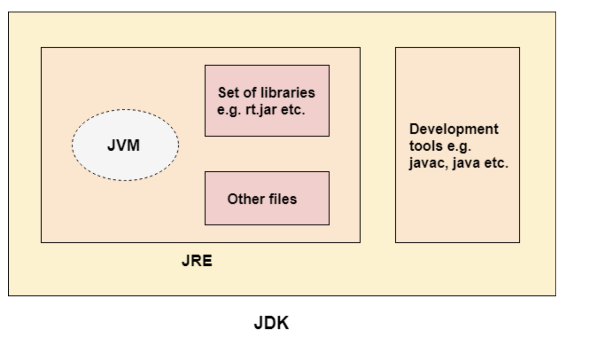
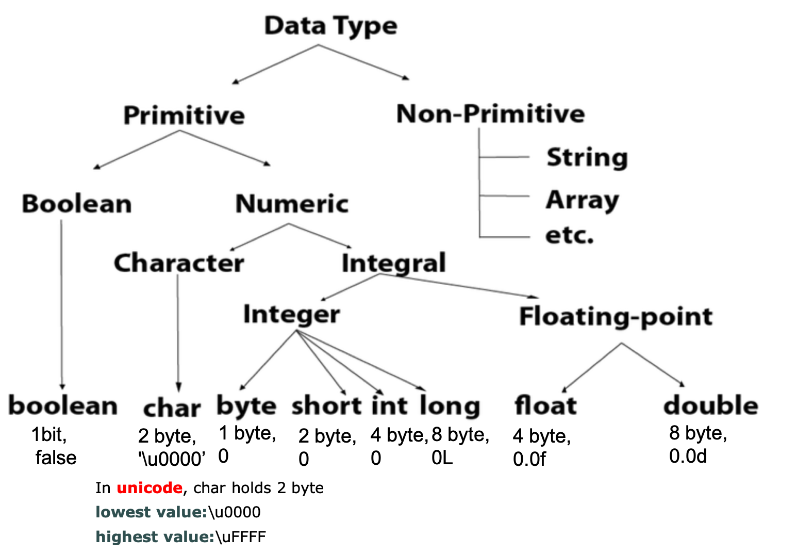

# Java Features

*  [Platform independent, portable, high performance, secure](#Machine-code-vs-Bytecode)
*  [Automatic garbage collection](#JAVA-GC)
*  [Object Oriented Programming](#OOP)
*  [Multithread](#Multithread)

# Java Cheatsheet

*  [Java Data type](#java-data-type)
*  [Variables](#Java-Variables)
*  [leetcode](https://github.com/lvchen727/leetcode)
    *  [Array](https://github.com/lvchen727/leetcode/blob/master/Array.md)
    *  [String](https://github.com/lvchen727/leetcode/blob/master/String.md)
    *  [Linkedlist](https://github.com/lvchen727/leetcode/blob/master/LinkedList.md)
    *  [HashTable](https://github.com/lvchen727/leetcode/blob/master/HashTable.md)
    *  [Math](https://github.com/lvchen727/leetcode/blob/master/Math.md)
    *  [Tree](https://github.com/lvchen727/leetcode/blob/master/Tree.md)
    *  [Bit](https://github.com/lvchen727/leetcode/blob/master/BitAndMath.md)
    *  [Graph](https://github.com/lvchen727/leetcode/blob/master/Graph.md)
    *  [Search](https://github.com/lvchen727/leetcode/blob/master/Search.md)
    *  [Queue, Stack, Heap](https://github.com/lvchen727/leetcode/blob/master/StackQueueHeap.md)
    *  [Backtracking](https://github.com/lvchen727/leetcode/blob/master/backtracking.md)
    *  [Backtracking](https://github.com/lvchen727/leetcode/blob/master/backtracking.md)
    *  [DP](https://github.com/lvchen727/leetcode/blob/master/DP.md)

#  [Reference](#reference)


## Machine code vs Bytecode

### Machine language (machine code, object code)

Machine language is a collection of binary digits or bits that the computer reads and interprets. It is the only language a computer can understand. 

The exact machine language differs by operating system. The specific operating system will determine how a compiler writes a program or action into machine language.  That's why certain programming languages like C and C++ require different platform compilers for different operating systems depending on the hardware and CPU communication methods. 


### Bytecode (portable code, p-code, intermediate code)

Bytecode is object-oriented programming code compiled to run on a virtual machine(VM) instead of a CPU. The VM transforms program code into readable machine language for CPU.

Bytecode is platform-independent, instead, VM takes responsibility for platform interpreability.

That's why JAVA is platform independent. Java code is compiled and coverted into bytecode which has .class extension that can be executed by Java VM. Java is a write once, run anywhere language. Compiled Jave code(bytecode) can be run on multiple operating systems, ie, Java is portable!

Java is an interpreted lanaguage. Java bytecode is fast and close to native code(high performance), but it is still slower than compiled language like C++.


### JVM, JRE, JDK (platform dependent)

* **JVM**: Java Virtual Machine
Abstract machine that loads code, verifies code, executes code, and provides runtime environment
The most common JVM is ORACLE'S HOTSPOT

* **JRE**: Java Runtime Environment
 Implementation of JVM, physically exisits, contains a set of libraries + other files that JVM uses at runtime.

* **JDK**: Java Development Kit
JRE + development tools





Java provides **security** by default because it has 

1. no explicit pointers 
2. Java program runs inside a VM. 
3. Classloader: part of JRE. It adds security by separating the package for the classes of the local file system from those that are imported from network sources.
4. Bytecode Verifier: checks the code fragments for illegal code that can violate access right to objects.
5. Security Mananger: determines what resources a class can access such as reading and writing to the local disk.


### [Java vs C++](https://www.javatpoint.com/cpp-vs-java)


## Java GC

 GC")
> 
- **Young Generation**: Newly created objects start in the Young Generation. The Young Generation is further subdivided into an Eden space, where all new objects start, and two Survivor spaces, where objects are moved from Eden after surviving one garbage collection cycle. When objects are garbage collected from the Young Generation, it is a **minor garbage collection event**.
- **Old Generation**: Objects that are long-lived are eventually moved from the Young Generation to the Old Generation. When objects are garbage collected from the Old Generation, it is a **major garbage collection event**.
- Permanent Generation: Metadata such as classes and methods are stored in the Permanent Generation. Classes that are no longer in use may be garbage collected from the Permanent Generation.


## OOP

1. Object

2. Class

3. Inheritance

4. Polymorphism

5. Abstraction

6. Encapsulation


## Multithread


## Java Data Type



## Java Variables

```java
class A{  
  int data=50;//instance variable  
  static int m=100;//static variable  
  void method(){  
    int n=90;//local variable  
  }  
}//end of clas
```


## Reference

### Java tutorials
- [javatpoint](https://www.javatpoint.com/features-of-java)
- [tutorial point](https://www.tutorialspoint.com/java/index.htm)

### Other readings
- [Java GC](https://stackify.com/what-is-java-garbage-collection/)
- [Bytecode](https://www.techopedia.com/definition/3760/bytecode)
- [Machine language](https://www.computerhope.com/jargon/m/machlang.htm)

